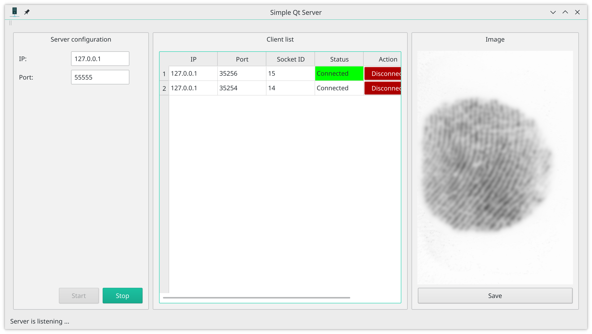

# Qt GUI server
This repository houses source code for an experimental server app communicating with its clients over unsecured TCP, written in Qt. The app allows to choose IP and port for TCP server and start listening. The app demonstrates the process of receiving new client connections, automatic/manual client disconnections and receiving fingerprint images from clients. The app expects images with dimensions of 320x480 (Suprema BioMini Slim scanner).

Here is the screenshot of the app's GUI running under Manjaro Linux with KDE Plasma desktop environment.

